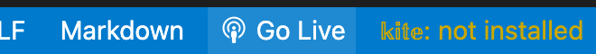

# Finscope-design

## live demo
[Link](https://sgmap.bnr.rw/)
## Built with
- Angular

## Installation

```js
git clone  https://github.com/espoirMur/cartix-web.git
Add environment variables 
Then run `sudo npm install -g @angular/cli`
check the `ng version` by running `ng --version`
If the version is shown, Go to the following step.
```
## Usage

Use the package manager [ng serve](https://angular.io/cli/serve) then run the following command.

```bash
ng serve -o --poll=2000 or 
ng serve --open  
```
if this is not showing click on : Go Live directly




## 🤝 Contributing

Contributions, issues, and feature requests are welcome!

## Show your support

Give a ⭐️ if you like this project!


